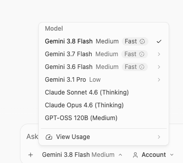
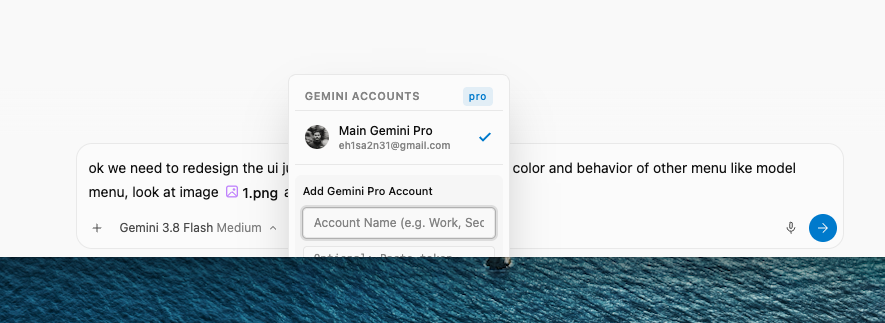
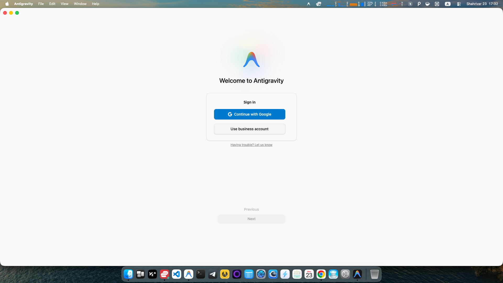
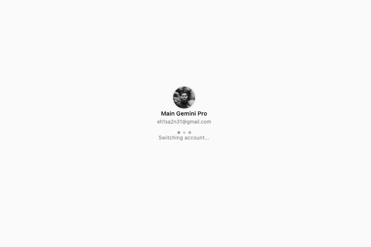
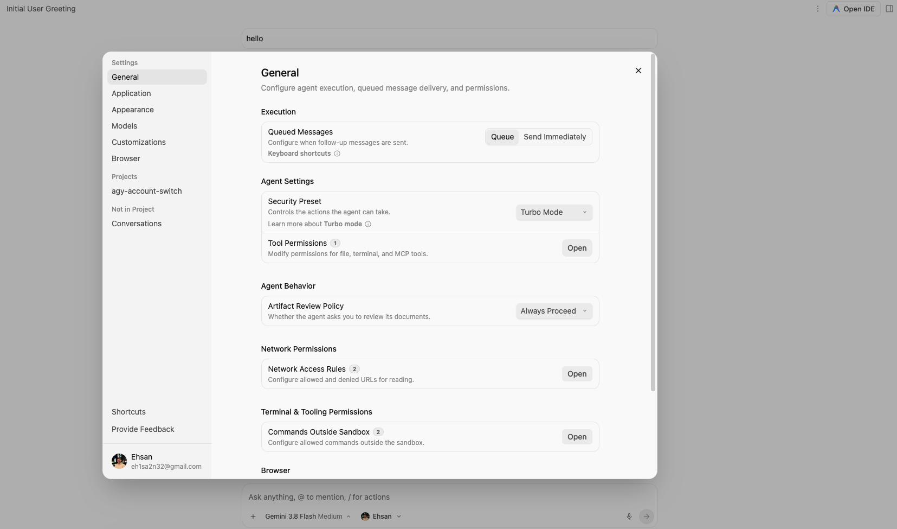

<div dir="rtl">

# سوییچر چنداکانته برنامه آنتی‌گرویتی (Antigravity Multi-Account Switcher)

[](LICENSE)
[](https://apple.com)
[](https://gemini.google.com)

یک افزونه و پچ بومی، سریع و بی‌نقص برای برنامه دسکتاپ **Google Antigravity** در سیستم‌عامل مک (macOS). این ابزار به شما امکان می‌دهد بدون نیاز به خروج از حساب کاربری یا ورود مکرر به مرورگر، به سادگی و تنها با یک کلیک بین چندین اکانت Gemini Pro جابه‌جا شوید.

> 🇬🇧 **English**: For English documentation, please see [README.md](README.md).

---

## 📑 فهرست مطالب

- [چرا به سوییچر اکانت آنتی‌گرویتی نیاز داریم؟](#-چرا-به-سوییچر-اکانت-آنتیگرویتی-نیاز-داریم)
- [راهنمای تصویری و نماهای برنامه](#-راهنمای-تصویری-و-نماهای-برنامه)
- [ویژگی‌های کلیدی](#-ویژگیهای-کلیدی)
- [نحوه کارکرد فنی (Architecture)](#-نحوه-کارکرد-فنی-architecture)
- [پیش‌نیازها](#-پیشنیازها)
- [راهنمای نصب سریع](#-راهنمای-نصب-سریع)
- [راهنمای استفاده](#-راهنمای-استفاده)
- [ابزار خط فرمان (CLI)](#-ابزار-خط-فرمان-cli)
- [بررسی سلامت و عیب‌یابی (Doctor)](#-بررسی-سلامت-و-عیبیابی-doctor)
- [حذف و بازگردانی به نسخه اصلی](#-حذف-و-بازگردانی-به-نسخه-اصلی)
- [امنیت و حریم خصوصی](#-امنیت-و-حریم-خصوصی)
- [پرسش‌های متداول (FAQ)](#-پرسشهای-متداول-faq)
- [لایسنس](#-لایسنس)

---

## 💡 چرا به سوییچر اکانت آنتی‌گرویتی نیاز داریم؟

برنامه‌نویسان و کاربرانی که از Google Antigravity برای کدنویسی هوشمند استفاده می‌کنند معمولاً چند اکانت مختلف گوگل دارند:
- **تفکیک کار و پروژه‌های شخصی**: نگهداری مخازن شرکتی در یک اکانت و پروژه‌های آزاد در اکانت دیگر.
- **مدیریت سهمیه و محدودیت‌ها (Quota Limits)**: زمانی که محدودیت مصرف ساعتی یا هفتگی مدل‌های Gemini Pro در یک اکانت پر می‌شود، سوییچ فوری به اکانت دوم بسیار حیاتی است.
- **محیط‌های کاری کلاینت‌ها**: اتصال به حساب‌های سازمانی و کلاد مشتریان مختلف.

به طور عادی برای تغییر اکانت باید از برنامه لاگ‌اوت کنید و تمام مراحل ورود را در مرورگر طی نمایید. **Antigravity Account Switcher** با ذخیره امن توکن‌ها در Keychain مک، امکان **تغییر اکانت تنها با ۱ کلیک** را دقیقاً در نوار ورودی متن پرامپت فراهم می‌سازد.

---

## 📸 راهنمای تصویری و نماهای برنامه

### ۱. منوی اصلی سوییچ اکانت
دکمه انتخاب اکانت درست در کنار منوی مدل‌ها در نوار ورودی ظاهر می‌شود. استایل این منو با پالت رنگی اختصاصی، فونت‌ها و سایه استاندارد (`shadow-md`) برنامه کاملاً هماهنگ است و تیک اکانت فعال در منتهی‌الیه سمت راست قرار گرفته است.

<p align="center">
  
</p>

- **اکانت فعال**: با تیک رسمی متریال گوگل در سمت راست مشخص شده است.
- **تغییر سریع**: با یک کلیک روی هر اکانت، توکن فعال بلافاصله جایگزین می‌شود.
- **ابزارهای هاور**: با نگه‌داشتن ماوس روی هر ردیف، دکمه تغییر نام (مداد) و حذف (سطل زباله) نمایان می‌شود.

---

### ۲. بخش افزودن اکانت جدید (Add Account)
افزودن اکانت جدید مستقیماً از داخل همان منو بدون شلوغی‌های اضافه امکان‌پذیر است.

<p align="center">
  
</p>

- **نام‌گذاری دلخواه**: می‌توانید برای هر اکانت نامی مثل "کاری"، "شخصی" یا "تستی" بگذارید.
- **دکمه ورود اختصاصی**: دکمه ورود با گوگل کاملاً مطابق استایل دکمه‌های ثانویه آنتی‌گرویتی طراحی شده است.

---

### ۳. فرایند ورود امن با گوگل
اتصال به چرخه رسمی ورود آنتی‌گرویتی برای دریافت توکن امن OAuth بدون ریسک امنیتی.

<p align="center">
  
</p>

---

### ۴. صفحه ترنزیشن و لودینگ کاملاً مات
در هنگام سوییچ اکانت، یک صفحه ترنزیشن اختصاصی با پس‌زمینه ۱۰۰٪ مات، آواتار اکانت جدید، ایمیل، و انیمیشن پالس سه‌نقطه‌ای آنتی‌گرویتی ظاهر می‌شود.

<p align="center">
  
</p>

- **عدم تداخل با متن‌های زیرین**: پس‌زمینه سالید و مات مانع از مشخص شدن ادیتور پشت صفحه در زمان تعویض لایسنس سرور می‌شود.
- **نمایش وضعیت زنده**: نمایش جزئیات اکانت در طول چند لحظه آماده‌سازی سرور زبان.

---

### ۵. تایید اکانت فعال در تنظیمات داخلی
پس از سوییچ، هویت جدید فعال بلافاصله در تمام بخش‌های نرم‌افزار، از جمله پنجره تنظیمات (Settings) و نوار پرامپت، شناسایی و اعمال می‌گردد.

<p align="center">
  
</p>

---

## ⚡ ویژگی‌های کلیدی

- **تزریق بومی در نرم‌افزار (Native Injection)**: تزریق مستقیم در رندرر Electron از طریق Preload بدون نیاز به باز کردن برنامه‌های مجزا یا آیکون‌های اضافی منوبار.
- **تراز دقیق تیک به راست**: رفع مشکل وسط قرار گرفتن تیک و تنظیم دقیق آن در سمت راست مشابه منوی رسمی اپلیکیشن.
- **امکان تغییر نام اکانت (Inline Rename)**: ویرایش نام نمایشی هر اکانت با کلیک روی آیکون مداد همراه با کلیدهای میانبر (`Enter` برای ذخیره و `Esc` برای لغو).
- **امنیت کامل با macOS Keychain**: توکن‌ها در فضای امن جاکلیدی مک (`service: gemini`, `account: antigravity`) نگهداری می‌شوند.
- **پشتیبان‌گیری خودکار**: پیش از اعمال هر تغییری، یک نسخه پشتیبان از فایل اصلی برنامه در `app.asar.backup` ذخیره می‌شود.
- **قابلیت بازگردانی سریع**: امکان حذف کامل پچ و بازگردانی به نسخه فابریک کارخانه تنها با اجرای یک اسکریپت.

---

## 🏗️ نحوه کارکرد فنی (Architecture)

نرم‌افزار آنتی‌گرویتی اطلاعات احراز هویت را در دو بخش ذخیره می‌کند:
1. **جاکلیدی مک (macOS Keychain)**: سرویس `gemini`، اکانت `antigravity`.
2. **فایل‌های توکن محلی**: `~/.gemini/jetski-standalone-oauth-token` و `~/.gemini/google_accounts.json`.

در زمان تغییر حساب:
۱. توکن اکانت انتخابی از پوشه `~/.gemini/accounts/<id>.token` خوانده می‌شود.
۲. جاکلیدی مک با دستور `security` به صورت اتمیک به‌روزرسانی می‌شود.
۳. توکن‌های مسیر `~/.gemini/` به‌روزرسانی می‌گردند.
۴. سیگنال ری‌استارت به پروسس پس‌زمینه `language_server` ارسال می‌شود تا اعتبارنامه جدید را لود کند.
۵. صفحه برنامه رفرش شده و هویت جدید فعال می‌گردد.

---

## 📋 پیش‌نیازها

- **سیستم‌عامل**: مک (پردازنده‌های M1/M2/M3/M4 اپل سیلیکون یا اینتل).
- **برنامه آنتی‌گرویتی**: نصب در مسیر پیش‌فرض `/Applications/Antigravity.app`.
- **محیط Node.js**: نسخه 18 یا بالاتر.

---

## 🚀 راهنمای نصب سریع

مخزن را کلون کرده و اسکریپت نصب را اجرا کنید:

```bash
git clone https://github.com/EhsanShahbazii/agy-account-switch.git
cd agy-account-switch
./scripts/install.sh
```

این اسکریپت به صورت خودکار:
۱. از سلامت فایل‌ها و وجود نسخه اصلی بک‌آپ تهیه می‌کند.
۲. پچ را در فایل‌های برنامه اعمال کرده و ماژول‌های MCP را حفظ می‌کند.
۳. برنامه را با امضای محلی مجاز (`codesign`) امضا می‌کند.

سپس کافی است برنامه **Antigravity** را باز کنید تا دکمه انتخاب اکانت را در نوار ورودی متن مشاهده فرمایید.

---

## 🎯 راهنمای استفاده

### تغییر اکانت
۱. روی دکمه اکانت در نوار پرامپت کلیک کنید.
۲. اکانت مورد نظر خود را انتخاب نمایید.
۳. صفحه انتقال برای حدود ۱ ثانیه ظاهر شده و سوییچ تکمیل می‌گردد.

### افزودن اکانت جدید
۱. روی دکمه اکانت و سپس **Add Account** کلیک کنید.
۲. نام دلخواه اکانت را وارد نمایید.
۳. دکمه **Sign in with Google** را بزنید و در مرورگر وارد شوید.

### تغییر نام اکانت
۱. ماوس را روی اکانت مورد نظر ببرید.
۲. روی آیکون مداد کلیک کنید.
۳. نام جدید را بنویسید و کلید `Enter` را فشار دهید.

---

## 💻 ابزار خط فرمان (CLI)

مدیریت اکانت‌ها از طریق ترمینال نیز ممکن است:

```bash
# مشاهده لیست اکانت‌ها و وضعیت فعال
node bin/agy-switch.js list

# مشاهده اکانت فعال فعلی
node bin/agy-switch.js current

# سوییچ به اکانت مورد نظر از طریق شناسه
node bin/agy-switch.js switch <accountId>
```

---

## 🩺 بررسی سلامت و عیب‌یابی (Doctor)

جهت بررسی صحت نصب و فایل‌های سیستم:

```bash
./scripts/doctor.sh
```

---

## 🔄 حذف و بازگردانی به نسخه اصلی

جهت حذف پچ و بازگشت کامل برنامه به حالت اولیه کارخانه:

```bash
./scripts/uninstall.sh
```

---

## 🔒 امنیت و حریم خصوصی

- هیچ اطلاعاتی به هیچ سرور خارجی یا شخص ثالث ارسال نمی‌گردد.
- تمام توکن‌ها به صورت رمزنگاری‌شده در Keychain مک ذخیره می‌شوند.
- کدها کاملاً متن‌باز و قابل بازرسی هستند.

---

## 📄 لایسنس

این پروژه تحت لایسنس [MIT](LICENSE) منتشر شده است.

نویسنده: **[احسان شهبازی (Ehsan Shahbazi)](https://github.com/EhsanShahbazii)**  
گیت‌هاب: [@EhsanShahbazii](https://github.com/EhsanShahbazii)


</div>
