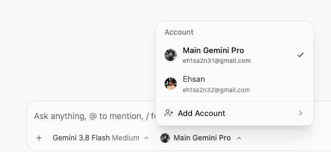

# Antigravity Multi-Account Switcher

[](LICENSE)
[](https://apple.com)
[](https://gemini.google.com)

A native, seamless multi-account switcher injected directly into Google's **Antigravity** desktop macOS app. Switch, add, rename, and manage multiple Gemini Pro / Google accounts with zero friction directly in your prompt toolbar.

> 🌍 **Persian / فارسی**: برای مطالعه راهنمای فارسی به [README.fa.md](README.fa.md) مراجعه کنید.

---

## ✨ Features

- **Natively Injected**: Integrated right inside Antigravity's prompt toolbar next to the model selector.
- **Pixel-Perfect Styling**: 100% matched to Antigravity's native design tokens, typography, soft shadow (`shadow-md`), and Google Material Symbols.
- **Far-Right Checkmark**: Active account indicator pinned to the far right, exactly matching the native model menu.
- **Inline Rename**: Rename any account directly from the menu with keyboard shortcuts (Enter to save, Esc to cancel).
- **Smooth Opaque Switcher**: Full-screen solid theme overlay with Antigravity animated dot pulse loader.
- **Secure Keychain Storage**: Uses macOS Keychain (`service: gemini`, `account: antigravity`) and syncs `~/.gemini/accounts/`.
- **Safe 1-Click Install & Uninstall**: Automatically backs up `app.asar.backup` and allows full restoration anytime.

---

## 📸 Screenshots

| Native Model Menu | Account Switcher | Add Account |
| :---: | :---: | :---: |
|  |  |  |

---

## 🚀 Quick Start

### 1. Clone & Install
```bash
git clone https://github.com/EhsanShahbazii/agy-account-switch.git
cd agy-account-switch
./scripts/install.sh
```

### 2. Restart Antigravity
Open or restart **Antigravity.app**. You will see the account switcher button appear beside the model selector (`Gemini 3.8 Flash Medium`).

---

## 🛠️ Diagnostics & CLI

Check the health and patch status:
```bash
./scripts/doctor.sh
```

Terminal switching via CLI:
```bash
node bin/agy-switch.js list
node bin/agy-switch.js switch <accountId>
```

---

## 🔄 Uninstallation

To restore Antigravity back to its pristine factory state:
```bash
./scripts/uninstall.sh
```

---

## 🔒 Security & Privacy

- All credentials remain stored in your local **macOS Keychain**.
- No credentials or tokens are ever transmitted outside your machine.
- Open-source, inspectable, and sandboxed within Antigravity's local environment.

---

## 📄 License

MIT © [Ehsan Shahbazi](https://github.com/EhsanShahbazii)

---

## ❓ FAQ & Troubleshooting

### Q: Does this require disabling SIP or disabling Gatekeeper?
**A:** No. The patch modifies `app.asar` and applies a valid ad-hoc local code signature (`codesign --force --deep --sign -`), ensuring macOS allows it to execute without security warnings.

### Q: What happens if Antigravity updates?
**A:** When Antigravity updates, its new `app.asar` will replace the patched version. Simply re-run `./scripts/install.sh` to reapply the switcher in seconds.
